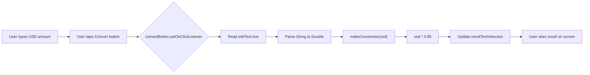
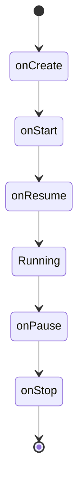
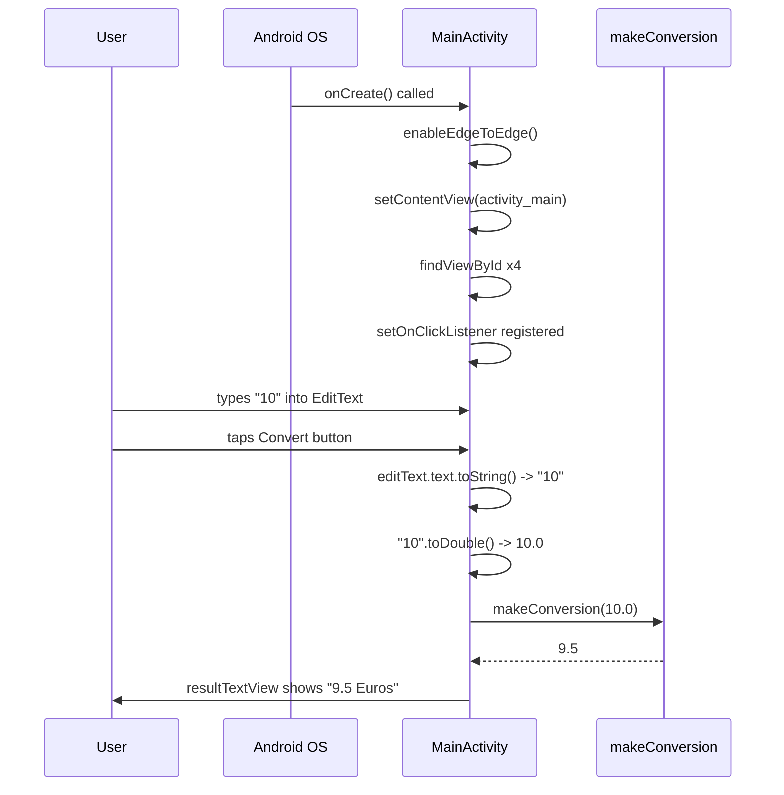

# 💱 CurrencyConverter — A Beginner's Guide to This App

> A hands-on README that teaches Android fundamentals *through* this specific app's code — not a generic tutorial.

## 📋 Table of Contents
1. [TL;DR and What You'll Learn](#1-tldr-and-what-youll-learn)
2. [The Big Picture](#2-the-big-picture)
3. [Project Structure](#3-project-structure)
4. [Concept-by-Concept Deep Dives](#4-concept-by-concept-deep-dives)
5. [End-to-End Walkthrough](#5-end-to-end-walkthrough)
6. [Glossary](#6-glossary)
7. [Suggested Enhancements](#7-suggested-enhancements)
8. [Further Reading](#8-further-reading)

---

## 1. TL;DR and What You'll Learn

**The app in one sentence:** the user types a number of US dollars into a text box, taps a button, and the app multiplies that number by a fixed exchange rate (0.95) and shows the result in euros.

That's it. No internet connection, no database, no saved state — just input → math → output. That simplicity is exactly what makes it a good place to *anchor* real Android concepts before layering on complexity.

**By the end of this README you'll understand:**
- How an Android `Activity` is structured and what `onCreate()` actually does
- How Kotlin code finds and talks to on-screen views (`findViewById`)
- Why `lateinit var` exists and what breaks if you misuse it
- How button clicks are wired up with listeners
- How raw text input gets converted into a number — and where that's fragile
- What "edge-to-edge" display means and a subtle bug hiding in this exact file
- Where this app's architecture would need to grow if it became a "real" production app

**Prerequisites:** basic Kotlin syntax (variables, functions, classes). No prior Android experience needed.

**Estimated reading time:** ~15 minutes.

💡 **Tip:** This app is small enough that you can read the entire source in 30 seconds. Do that now, then come back — the rest of this document will make a lot more sense once you've seen the whole shape of it.

```kotlin
package com.vineetganti.currencyconverter

class MainActivity : AppCompatActivity() {
    lateinit var titleTextView: TextView
    lateinit var resultTextView: TextView
    lateinit var editText: EditText
    lateinit var convertButton: Button

    override fun onCreate(savedInstanceState: Bundle?) {
        super.onCreate(savedInstanceState)
        enableEdgeToEdge()
        setContentView(R.layout.activity_main)
        // ...find views, set click listener, convert...
    }

    fun makeConversion(usd: Double): Double = usd * 0.95
}
```

---

## 2. The Big Picture

### 🏙️ The restaurant analogy

Think of this app as a **single-waiter diner**:

- The **`EditText`** is the order slip the customer writes their request on.
- The **`Button`** is the bell the customer rings to say "I'm ready."
- **`MainActivity`** is the one waiter who does *everything* — takes the order, walks to the kitchen, cooks it, brings it back.
- **`makeConversion()`** is the kitchen — a tiny one, with exactly one recipe (multiply by 0.95).
- The **`resultTextView`** is the plate the finished dish comes back on.

In a bigger restaurant (a bigger app), you'd split these jobs up: a host, a waiter, a chef, a supplier who delivers fresh ingredients (live exchange rates) every morning. Here, one person does it all — which is fine for a one-table diner, but wouldn't scale to a busy restaurant. Keep that image in mind; it'll matter in [Section 7](#7-suggested-enhancements).

### Data flow diagram



### Why no "architecture" here?

🤔 **Why?:** Patterns like MVVM, Repositories, and Dependency Injection exist to manage *complexity* — multiple data sources, background work, testability, team collaboration. This app has one screen, no network calls, and one calculation. Introducing those patterns now would be like installing a walk-in freezer in a food truck: technically possible, but solving a problem you don't have yet. We'll revisit this honestly in the enhancements section, because it's a great next step — just not a "beginner" one.

---

## 3. Project Structure

Only one source file was shared with me, so this section reflects exactly that:

```
com.vineetganti.currencyconverter/
└── MainActivity.kt      # The entire app: UI wiring + conversion logic
```

⚠️ **Not included in what you shared:** `activity_main.xml` (the layout file) and `build.gradle` (dependency declarations). The code *references* four views by ID — `textView`, `resultText`, `editText`, `convertBTN` — which tells us the layout must define at least these four elements, but I can't show you their exact XML attributes without that file. If you want that section written accurately, share `activity_main.xml` too.

**Standard Android convention reminder:** Kotlin/Java code lives under `app/src/main/java/<package>/`, and layout XML lives under `app/src/main/res/layout/`. `R.layout.activity_main` and `R.id.textView` are auto-generated references Android's build tools create *from* that XML — you never write the `R` class by hand.

---

## 4. Concept-by-Concept Deep Dives

### 🧠 4.1 The Activity Lifecycle & `onCreate()`

**Plain English:** An `Activity` is one screen of your app. Android doesn't just run your code top-to-bottom like a script — it calls specific methods on your Activity at specific moments (created, visible, focused, stopped, destroyed). `onCreate()` is the "setup" moment — it runs once, when the screen is first built.

**Why does it exist?** Because the *operating system*, not your code, decides when a screen appears, disappears, or gets destroyed (e.g., user rotates the phone, switches apps, gets a phone call). Your Activity needs a predictable hook to say "when I'm being built, do this setup."



**How this app uses it:**
```kotlin
override fun onCreate(savedInstanceState: Bundle?) {
    super.onCreate(savedInstanceState)
    enableEdgeToEdge()
    setContentView(R.layout.activity_main)
    // view setup + click listener happen here
}
```
The critical line is `setContentView(R.layout.activity_main)` — this is the moment the XML layout is "inflated" (turned into actual on-screen objects) and attached to this Activity. Nothing below that line would work without it — `findViewById` would have nothing to find.

⚠️ **Common pitfalls:**
- Forgetting `super.onCreate(savedInstanceState)` — this is required boilerplate; skipping it causes a crash.
- Calling `findViewById` *before* `setContentView` — it'll return `null` or crash, because the views don't exist in memory yet.

---

### 🧠 4.2 Finding Views: `findViewById` and `lateinit var`

**Plain English:** Your XML layout describes *what* views look like; your Kotlin code needs a *handle* to actually talk to them (change their text, read their input). `findViewById` walks the inflated layout tree and hands you that handle.

**Why `lateinit var`?** Kotlin requires every non-nullable property to have a value immediately — but these views literally don't exist until `setContentView` runs inside `onCreate`. `lateinit` is a promise to the compiler: *"trust me, I'll assign this before anyone tries to use it."*

```kotlin
lateinit var titleTextView: TextView
...
titleTextView = findViewById(R.id.textView)
```

🔑 **Key idea:** `lateinit` trades compile-time safety for a runtime risk. If you ever *read* a `lateinit var` before assigning it, the app crashes with `UninitializedPropertyAccessException` — there's no gentle `null` fallback.

⚠️ **Common pitfalls:**
- Accessing a `lateinit var` from a background thread that runs before `onCreate` finishes.
- Typo-ing an ID (`R.id.textview` vs `R.id.textView`) — this is a compile error, which is actually a *good* thing; it means you can't ship a mismatched reference.

---

### 🧠 4.3 Click Listeners

**Plain English:** A listener is a piece of code you hand to Android saying *"whenever this specific thing happens, run this."* It's like leaving a note with the front desk: "when this customer arrives, call me."

```kotlin
convertButton.setOnClickListener {
    val enterUSD: String = editText.text.toString()
    val enterUSDdouble: Double = enterUSD.toDouble()
    var euros = makeConversion(enterUSDdouble)
    resultTextView.text = "$euros Euros"
}
```

**Why this pattern?** The button doesn't know what "convert currency" means — and it shouldn't. Its only job is detecting taps. Your Activity supplies the *meaning* of a tap via the lambda passed to `setOnClickListener`.

⚠️ **Common pitfalls (this is the important one):**
- `enterUSD.toDouble()` will **crash the app** if the user leaves the field empty or types letters — `"abc".toDouble()` throws a `NumberFormatException`. There's no validation here yet. This is the single most likely bug a tester would hit in five seconds of use.
- 🐛 **Debug tip:** if this app crashes on tapping Convert, check Logcat for `NumberFormatException` first — it's almost certainly an empty or non-numeric `EditText`.

---

### 🧠 4.4 The Conversion Function

```kotlin
fun makeConversion(usd: Double): Double {
    val euro: Double = usd * 0.95
    return euro
}
```

**Why pull this into its own function** instead of writing the math inline inside the click listener? Separation of concerns, even at the smallest scale: `makeConversion` is a pure function — same input always gives the same output, no dependency on UI state. That makes it independently testable (you could unit-test it without touching a single Android view) and reusable if you ever add a second "Convert" trigger elsewhere in the app.

⚠️ **Common pitfall:** `0.95` is a **hardcoded exchange rate**, frozen at whatever it was when this code was written. Real exchange rates fluctuate constantly — this is the seed of the "Advanced additions" idea in Section 7.

---

### 🧠 4.5 Edge-to-Edge Display (and a hidden gotcha)

**Plain English:** Modern Android phones want apps to draw content behind the status bar and navigation bar for a more immersive look, rather than leaving black bars around them. `enableEdgeToEdge()` opts your Activity into that behavior.

```kotlin
import androidx.core.view.ViewCompat
import androidx.core.view.WindowInsetsCompat
...
enableEdgeToEdge()
```

⚠️ **Gotcha spotted in this exact file:** `ViewCompat` and `WindowInsetsCompat` are **imported but never used**. Normally, `enableEdgeToEdge()` needs to be paired with an insets listener (using exactly those two classes) to push your content below the status bar so buttons and text don't get physically covered by it. Without that listener, on some devices your top view (`titleTextView`) may render partially underneath the status bar.

💡 **Tip:** This is a great "find the bug" exercise — the imports are a strong hint that a `ViewCompat.setOnApplyWindowInsetsListener(...)` call was intended but never added.

---

## 5. End-to-End Walkthrough

**"What happens when the user opens the app and converts $10?"**



Every step above maps directly to a concept from Section 4 — the lifecycle hook (4.1), the view handles (4.2), the listener (4.3), and the pure calculation (4.4).

---

## 6. Glossary

- **Activity** — a single screen in an Android app, with its own lifecycle managed by the OS.
- **`AppCompatActivity`** — a base Activity class from AndroidX that adds backward-compatible support for modern UI features on older Android versions.
- **Edge-to-edge** — a display mode where app content draws behind the system status/navigation bars.
- **`findViewById`** — a method that retrieves a reference to a view defined in XML, by its ID.
- **Inflate / Inflation** — the process of turning an XML layout file into live view objects in memory.
- **`lateinit`** — a Kotlin modifier allowing a non-nullable property to be assigned after declaration, before first use.
- **Lifecycle** — the sequence of states (`onCreate`, `onStart`, `onResume`, etc.) an Activity moves through.
- **Listener** — a callback registered to run when a specific event occurs (e.g., a click).
- **`NumberFormatException`** — a runtime crash thrown when parsing a non-numeric String to a number type.
- **`R` class** — an auto-generated Kotlin/Java class mapping resource names (layouts, IDs, strings) to integer constants.
- **`setContentView`** — the call that attaches an inflated layout to an Activity.

---

## 7. Suggested Enhancements

### 🟢 Beginner additions
- **Input validation** — check for empty/non-numeric input before calling `.toDouble()`, and show an error message instead of crashing. *Files:* `MainActivity.kt`. *New concept:* `try/catch`, or Kotlin's `toDoubleOrNull()`.
- **Multiple currencies** — add a `Spinner` or dropdown to pick from EUR, GBP, JPY, each with its own rate. *Files:* `MainActivity.kt`, `activity_main.xml`. *New concept:* `when` expressions, `AdapterView.OnItemSelectedListener`.
- **Decimal formatting** — round the result to 2 decimal places instead of showing raw `Double` precision. *New concept:* `String.format()` or `"%.2f".format(euro)`.

### 🟡 Intermediate additions
- **ViewModel + configuration change survival** — currently, rotating the phone re-runs `onCreate` and loses any in-progress state. Moving the conversion logic into a `ViewModel` would let it survive rotation. *Files:* new `MainViewModel.kt`. *New concept:* `ViewModel`, `LiveData`/`StateFlow`.
- **View Binding** — replace manual `findViewById` calls with Android's View Binding for compile-time-safe view references. *Files:* `build.gradle`, `MainActivity.kt`. *New concept:* generated `ActivityMainBinding` class.
- **Local conversion history with Room** — save each conversion to a small local database. *Files:* new `ConversionEntity.kt`, `ConversionDao.kt`, `AppDatabase.kt`. *New concept:* Room, DAOs, SQLite under the hood.

### 🔴 Advanced additions — this is where the "big app" concepts belong
- **Live exchange rates via Retrofit** — replace the hardcoded `0.95` with a real API call to a currency-rates service. *Files:* new `CurrencyApiService.kt`, `RetrofitClient.kt`. *New concept:* Retrofit, REST APIs, Coroutines for async network calls.
- **Repository pattern** — introduce a `CurrencyRepository` as the single source of truth, deciding whether to serve cached or fresh rates. *Files:* new `CurrencyRepository.kt`. *New concept:* single source of truth, separation between data and UI layers.
- **Dependency Injection with Hilt** — instead of `MainActivity` constructing its own dependencies, let Hilt provide them. *Files:* new `AppModule.kt`, `@HiltAndroidApp` Application class. *New concept:* DI, `@Inject`, `@Provides` — think of it as ordering a finished meal from a menu instead of growing your own vegetables, milling your own flour, and cooking from absolute scratch every time.
- **Paginated conversion history with Paging 3** — if conversion history grows large, load it in pages rather than all at once. *Files:* new `HistoryPagingSource.kt`, `PagingDataAdapter`. *New concept:* `PagingSource`, `LoadStateAdapter`, RecyclerView + Paging cooperation.

💡 **Tip:** Notice the progression — beginner fixes make the *existing* code safer, intermediate additions make it *structured*, and advanced additions make it *scalable*. That's the same path every production Android app has walked.

---

## 8. Further Reading

- [Android Activity Lifecycle — official docs](https://developer.android.com/guide/components/activities/activity-lifecycle)
- [Kotlin `lateinit` — official docs](https://kotlinlang.org/docs/properties.html#late-initialized-properties-and-variables)
- [Edge-to-edge display guide](https://developer.android.com/develop/ui/views/layout/edge-to-edge)
- [ViewModel overview](https://developer.android.com/topic/libraries/architecture/viewmodel)
- [Retrofit](https://square.github.io/retrofit/)
- [Hilt dependency injection](https://developer.android.com/training/dependency-injection/hilt-android)
- [Paging 3 library overview](https://developer.android.com/topic/libraries/architecture/paging/v3-overview)

---

*Last updated: September 4th 2026*